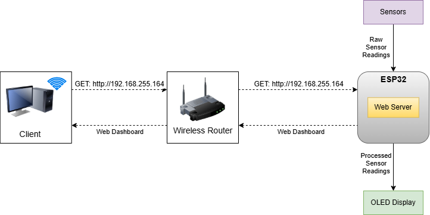

# Jiji Safi: IoT-based Air Quality Monitoring for Real-Time Jogging Route Safety

## Project Overview
This project focuses on designing and implementing an environmental monitoring system that guides joggers in selecting safer routes for jogging in real-time.

The system implemented measures temperature, humidity, and air quality using DHT22 and MQ135 sensors. It displays data on an OLED screen, and serves the application through a local Wi-Fi web interface.

## Installation and Setup

### Pre-requisites

#### Software Components
- **Arduino IDE** (v1.8.x or 2.x)
- **ESP32 Board support** installed via Board Manager
- **Libraries** (install via Arduino Library Manager):
  - `DHT sensor library by Adafruit`
  - `Adafruit Unified Sensor`
  - `Adafruit SSD1306`
  - `Adafruit GFX Library`

#### Hardware Components
- ESP32 Dev Board
- DHT22 Sensor
- MQ135 Gas Sensor
- SSD1306 128x64 OLED Display (I2C)


### Setup Instructions

1. Clone the repository:
   ```bash
   git clone https://github.com/yourusername/jiji-safi.git
   cd jiji-safi
   ```

2. Open the `.ino` file in Arduino IDE.

3. Update the Wi-Fi credentials in the code:
   ```cpp
   // WiFi credentials
   const char* ssid = "Wokwi-GUEST"; // Change to your SSID
   const char* password = ""; // Set to your Wi-Fi Password
   ```

4. Connect your ESP32 via USB.

5. Select the correct Board (ESP32 Dev Module) and Port.

6. Upload the sketch to your board.


## Basic Usage
- Once the sketch has been uploaded, the ESP32 attempts to connect to your Wi-Fi network.
- The Serial Monitor shows the Wi-Fi IP address for the web server. Access the web dashboard using the IP address provided.
- OLED displays live data, as the web dashboard updates in real-time as well.

## System Architecture
The diagram below shows a high-level system architecture of the IoT system implemented.
It represents a simple client-server interaction, with the client being the end-device accessing the dashboard,
which is hosted by the ESP32. Wi-Fi communication technology was implemented for the system.



## Acknowledgements
- [Adafruit](https://www.adafruit.com/): For the sensor and OLED display libraries.
- [Wokwi Simulator](https://wokwi.com/): For the simulation platform.

